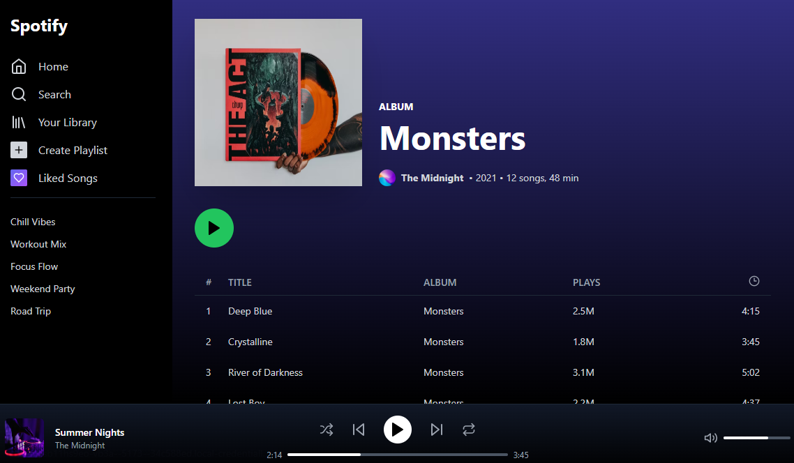

# spotify

Un clon de la aplicación web de Spotify construido con tecnologías web modernas.

### Descripción
Este repositorio contiene un clon de la aplicación web de Spotify. Está construido principalmente usando TypeScript, con soporte adicional de JavaScript, CSS y HTML.

### Lenguajes de Programación Utilizados

TypeScript: 81.8%
JavaScript: 10%
CSS: 4.5%
HTML: 3.7%
Stack Web

### Demo

[⚡](https://stackblitz.com/~/github.com/slf188/spotify)

### Tecnologías y bibliotecas

React: Una biblioteca de JavaScript para construir interfaces de usuario.

Vite: Una herramienta de construcción que ofrece una experiencia de desarrollo más rápida y ligera para proyectos web modernos.

Tailwind CSS: Un framework CSS de utilidad primero para el desarrollo rápido de UI.

ESLint: Una herramienta para identificar y solucionar problemas en el código JavaScript.

TypeScript: Un superconjunto tipado de JavaScript que se compila a JavaScript puro.

### Licencia
[LICENSE](LICENSE)

### Autor

Felipe Vallejo
